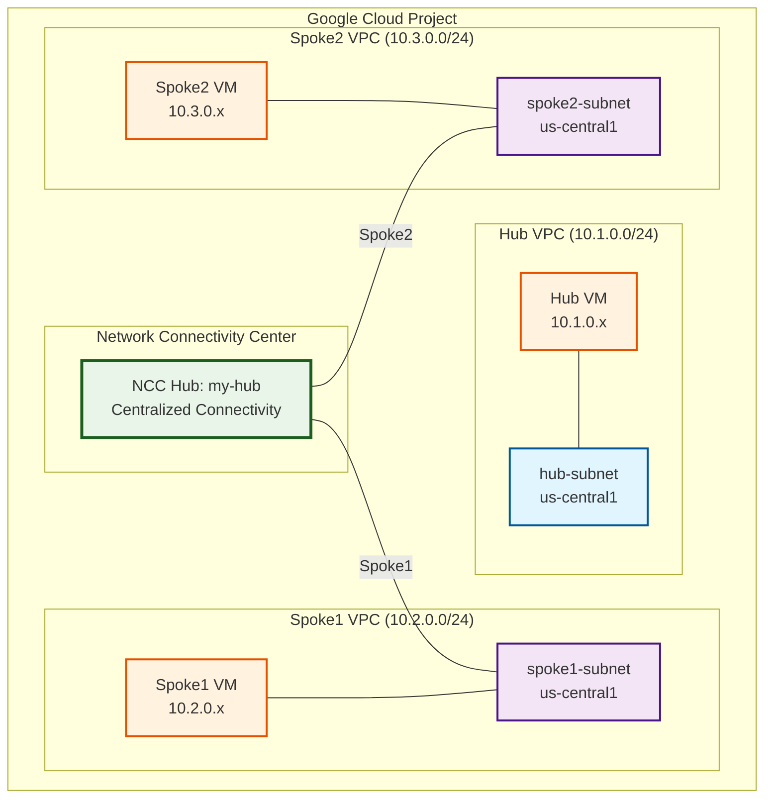
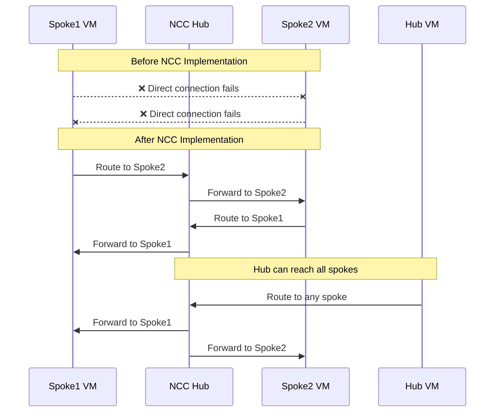
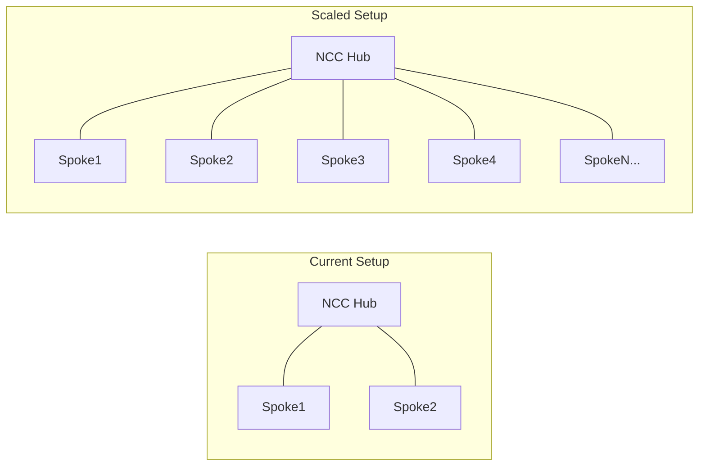

# Network Architecture Diagram

## Hub and Spoke Topology Overview



## Detailed Network Architecture

### Network Components

#### VPC Networks
| Network | CIDR Range | Region | Purpose |
|---------|------------|--------|---------|
| hub-vpc | 10.1.0.0/24 | us-central1 | Central hub network |
| spoke1-vpc | 10.2.0.0/24 | us-central1 | First spoke network |
| spoke2-vpc | 10.3.0.0/24 | us-central1 | Second spoke network |

#### Virtual Machines
| VM Name | Network | Internal IP | Machine Type | Purpose |
|---------|---------|-------------|--------------|---------|
| hub-vm | hub-vpc | 10.1.0.x | e2-micro | Hub connectivity testing |
| spoke1-vm | spoke1-vpc | 10.2.0.x | e2-micro | Spoke1 connectivity testing |
| spoke2-vm | spoke2-vpc | 10.3.0.x | e2-micro | Spoke2 connectivity testing |

#### Firewall Rules
| Rule Name | Networks | Protocols | Ports | Purpose |
|-----------|----------|-----------|-------|---------|
| app-allow-icmp-* | All VPCs | ICMP | - | Ping connectivity testing |
| app-allow-ssh-rdp-* | All VPCs | TCP | 22, 3389 | Remote access |

### Connectivity Flow Diagram



### Traffic Flow Patterns

#### Inter-Spoke Communication (via NCC)
```
Spoke1 VM → NCC Hub → Spoke2 VM
Spoke2 VM → NCC Hub → Spoke1 VM
```

#### Hub-to-Spoke Communication
```
Hub VM → NCC Hub → Spoke1/Spoke2 VM
Spoke1/Spoke2 VM → NCC Hub → Hub VM
```

### Network Topology Visualization

#### Physical Topology
```
┌─────────────────────────────────────────────────────────────┐
│                    Google Cloud Region                      │
│                      (us-central1)                         │
├─────────────────────────────────────────────────────────────┤
│  ┌─────────────┐    ┌─────────────┐    ┌─────────────┐     │
│  │   Hub VPC   │    │  Spoke1 VPC │    │  Spoke2 VPC │     │
│  │ 10.1.0.0/24 │    │ 10.2.0.0/24 │    │ 10.3.0.0/24 │     │
│  │             │    │             │    │             │     │
│  │   hub-vm    │    │  spoke1-vm  │    │  spoke2-vm  │     │
│  │  10.1.0.x   │    │   10.2.0.x  │    │   10.3.0.x  │     │
│  └─────────────┘    └─────────────┘    └─────────────┘     │
│           │                   │                   │         │
│           └───────────────────┼───────────────────┘         │
│                               │                             │
│                    ┌─────────────────┐                     │
│                    │  NCC Hub        │                     │
│                    │   (my-hub)      │                     │
│                    │                 │                     │
│                    │  Spoke1 ←→ Hub  │                     │
│                    │  Spoke2 ←→ Hub  │                     │
│                    └─────────────────┘                     │
└─────────────────────────────────────────────────────────────┘
```

#### Logical Connectivity Matrix

| Source | Destination | Before NCC | After NCC | Path |
|--------|-------------|------------|-----------|------|
| Spoke1 VM | Spoke2 VM | ❌ | ✅ | via NCC Hub |
| Spoke2 VM | Spoke1 VM | ❌ | ✅ | via NCC Hub |
| Hub VM | Spoke1 VM | ❌ | ✅ | via NCC Hub |
| Hub VM | Spoke2 VM | ❌ | ✅ | via NCC Hub |
| Spoke1 VM | Hub VM | ❌ | ✅ | via NCC Hub |
| Spoke2 VM | Hub VM | ❌ | ✅ | via NCC Hub |

### Security Architecture

#### Firewall Rules Matrix
```
┌─────────────┬─────────────┬─────────────┬─────────────┐
│   Rule      │   Hub VPC   │ Spoke1 VPC  │ Spoke2 VPC  │
├─────────────┼─────────────┼─────────────┼─────────────┤
│ ICMP Allow  │     ✅      │     ✅      │     ✅      │
│ SSH Allow   │     ✅      │     ✅      │     ✅      │
│ RDP Allow   │     ✅      │     ✅      │     ✅      │
└─────────────┴─────────────┴─────────────┴─────────────┘
```

### Scalability Considerations

#### Adding New Spokes


### Monitoring and Observability

#### Key Metrics to Monitor
- **Connectivity Status**: Spoke-to-spoke ping success rate
- **Latency**: Round-trip time between spokes
- **Throughput**: Bandwidth utilization across NCC
- **Network Topology**: Visual representation of connections
- **Route Propagation**: Time for routing updates

#### Network Topology Tool Features
- Real-time network visualization
- Traffic flow analysis
- Performance metrics
- Connection health status
- Regional traffic patterns

### Benefits of This Architecture

1. **Centralized Management**: Single point of control through NCC
2. **Simplified Routing**: No complex VPC peering configurations
3. **Scalability**: Easy addition of new spokes
4. **Full Mesh Connectivity**: All spokes can communicate
5. **Reduced Operational Overhead**: Less configuration maintenance
6. **Enhanced Monitoring**: Built-in topology and metrics visualization

### Implementation Notes

- All resources are deployed in `us-central1` region
- VMs use `e2-micro` machine type for cost efficiency
- Firewall rules allow necessary traffic for testing
- NCC provides automatic route exchange between spokes
- Network topology updates reflect in real-time
